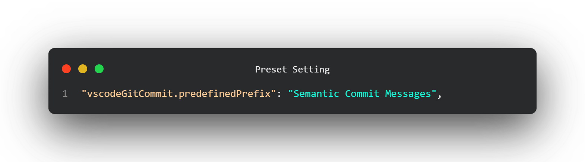
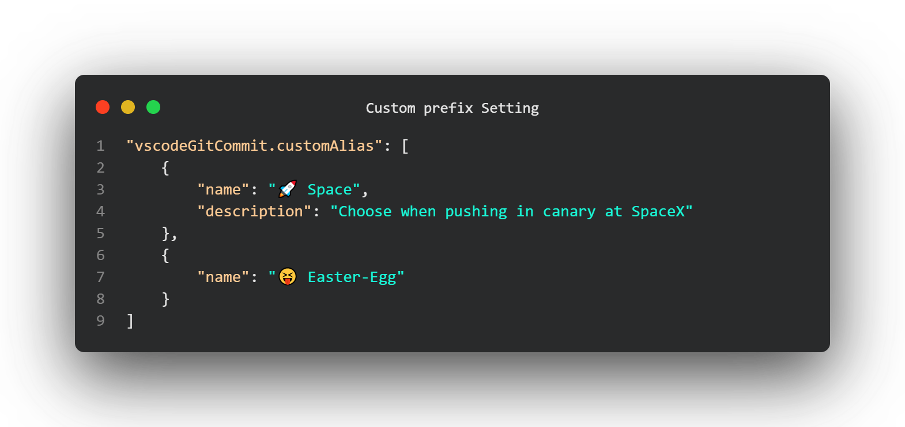
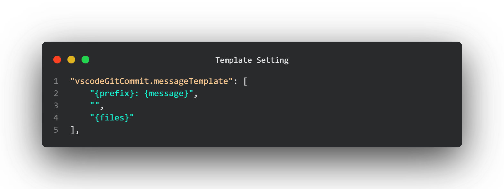

# VSCode Git Commit Message

VSCode git commit is a VSCode extension to create nice commit message with emoji and prefix.

> That's the first release :P

## How to use it ?

Use `ctrl+alt+enter` (`cmd+shift+enter` on Mac) or `click` on the icon in SouceControl

## Settings

### 1. **Erase previous commit on new one** (`vscodeGitCommit.insertMode`)

Options:

- Concatenate
- Replace

### 2. **Change default prefix with an other preset** (`vscodeGitCommit.predefinedPrefix`)

Options:

- Angular
- Semantic prefix
- My own prefix
- Alpha8
- None

> `None` Disable all predefined prefix for next setting **V**

### 3. **Add my own prefix set **(`vscodeGitCommit.customAlias`)

> Setting auto-completion is enabled

> Custom aliases are displayed first

### 4. **Create own template message** (`vscodeGitCommit.messageTemplate`)

> Each entry of the array is a new line in message template

> Variables are automatically prompted

> `{prefix}` variable display a selector prompt

> You can create as many lines as you want and as many variables as you want.

## Changelog

**1.1.5** (_12-18-2020_):  
📄docs (docs): update docs with animated gif

**1.1.4** (_11-06-2020_):  
✨feature: Handle multi repo case

**1.1.3** (_11-06-2020_):  
🐞fix: Update icon (cf: issues [#4](https://github.com/rioukkevin/vscode-git-commit/issues/4))  
🐞fix: Handle cancel action when typing variables (cf: issues [#5](https://github.com/rioukkevin/vscode-git-commit/issues/5))  
⚙️refactor: Refacto on extension command name

**1.1.1** (_10-20-2020_):
🐞fix: Update icon (cf: issues [#4](https://github.com/rioukkevin/vscode-git-commit/issues/4))

**1.1.0** (_10-12-2020_):  
✨feat(workflow): Add abilities to create custom message format using simple brackets in settings, see doc  
⚙️refactor(global): Refacto on major part of the code  
🌈style(typescript/prettier): Pass into prettier + update ts rules

**1.0.1** (_09-30-2020_):  
✨feature: On demand, add based commitizen prefix for alpha8  
🔵other: Change default mode to concatenate settings

**1.0.0** (_09-21-2020_):

> First Release, I've done it !!

✨feature: Replace icon with outlined

**0.0.4** (_09-15-2020_):  
✨feature: add a mode to concatenate message with existing or replace existing  
🐞fix: focus on quickPick not on scm input box when triggering extension

**0.0.3** (_08-25-2020_):  
✨feature: V0.0.3 add prefix sets

**0.0.2** (_08-23-2020_):  
✨feature: Add custom prefix setting  
🐞fix: Open SCM view when prefix selector is opened, not at the end of process

**0.0.1** (_08-18-2020_):  
Initial release

## Todo

- Add abilities to create custom prefix from prefix selector (cf: issues [#3](https://github.com/rioukkevin/vscode-git-commit/issues/3))

## The end

If you find english error, please create an issue, I'm a french guys !

**Have a nice day and be happy !**
