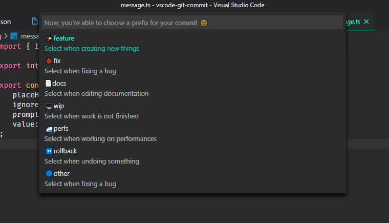
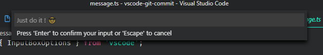
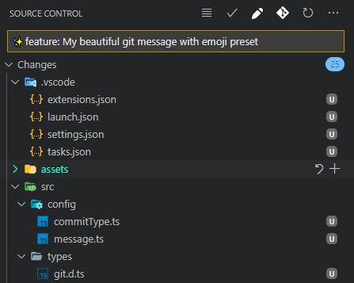
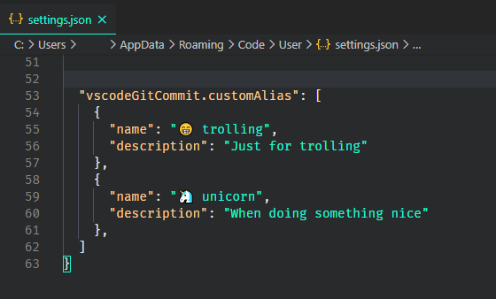

# VSCode Git Commit Message

VSCode git commit is a VSCode extension to create nice commit message with emoji and prefix.

> That's the first release :P


## How to use it ?

1. You have to execute the extension command with `ctrl+alt+enter` (`cmd+shift+enter` on Mac) or `click` on the icon in SouceControl Panel here  
   

2. Choose wich prefix you want
   

3. Complete with your commit message
   

4. Now you're done  
   

## Hmm wait, when I choose a second preset it erase the first one

Yeah I know, I add a settings to avoid this. In vscode settings, search for `VScode git commit`, there is one setting called **Vscode Git Commit: Insert Mode**.

Here you can choose to concatenate new messages or erase existing one by the new

## How to add custom prefix ?

In vscode settings, search for `VScode git commit`, there is one setting called **Vscode Git Commit: Custom Alias**.

Edit this setting, it open it in the json file.

With autocompletion, you can add prefix like this:  


## You don't love my prefix ? No problem

In vscode settings, search for `VScode git commit`, there is one setting called **Vscode Git Commit: Predefined Prefix**.

Here you can choose which prefix set you want. Available prefix set are:

- Angular
- Semantic prefix
- My own prefix
- Alpha8
- None

By choosing none, you have to define your prefix with setting **Vscode Git Commit: Custom Alias**

If you want me to add more prefix set, please create an issue with source of this set.

## Custom message format

Now you can create your custom message format using brackets to define variables
You can create as many variables as you want, an input box will be displayed for each ones.
One variable cannot be suppress, the variable named `prefix` will display a quickPick based on prefix set choosen.

It's better with an example:

Add a scope to the default message

```json
// settings.json
{
  // ...
  "vscodeGitCommit.messageTemplate": ["{prefix}({scope}): {message}"]
  // ...
}
```

When used, the extension detect 3 variables

- classic 'prefix'
- a 'scope'
- a 'message'

You can create as many lines as you want and as many variables as you want.

> the default format is `{prefix}: {message}`

## Changelog

**1.1.2** (_11-06-2020_):    
🐞fix: Update icon (cf: issues [#4](https://github.com/rioukkevin/vscode-git-commit/issues/4))   
🐞fix: Handle cancel action when typing variables (cf: issues [#5](https://github.com/rioukkevin/vscode-git-commit/issues/5))   
⚙️refactor: Refacto on extension command name     

**1.1.1** (_10-20-2020_): 
🐞fix: Update icon (cf: issues [#4](https://github.com/rioukkevin/vscode-git-commit/issues/4))

**1.1.0** (_10-12-2020_):  
✨feat(workflow): Add abilities to create custom message format using simple brackets in settings, see doc  
⚙️refactor(global): Refacto on major part of the code  
🌈style(typescript/prettier): Pass into prettier + update ts rules

**1.0.1** (_09-30-2020_):  
✨feature: On demand, add based commitizen prefix for alpha8  
🔵other: Change default mode to concatenate settings

**1.0.0** (_09-21-2020_):

> First Release, I've done it !!

✨feature: Replace icon with outlined

**0.0.4** (_09-15-2020_):  
✨feature: add a mode to concatenate message with existing or replace existing  
🐞fix: focus on quickPick not on scm input box when triggering extension

**0.0.3** (_08-25-2020_):  
✨feature: V0.0.3 add prefix sets

**0.0.2** (_08-23-2020_):  
✨feature: Add custom prefix setting  
🐞fix: Open SCM view when prefix selector is opened, not at the end of process

**0.0.1** (_08-18-2020_):  
Initial release

## Todo

- Add abilities to create custom prefix from prefix selector (cf: issues [#3](https://github.com/rioukkevin/vscode-git-commit/issues/3))

## The end

If you find english error, please create an issue, I'm a french guys !

**Have a nice day and be happy !**
