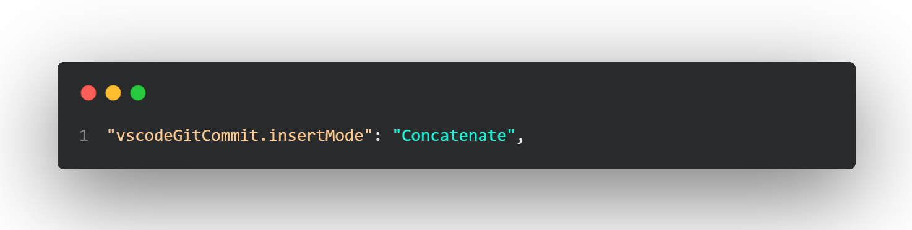
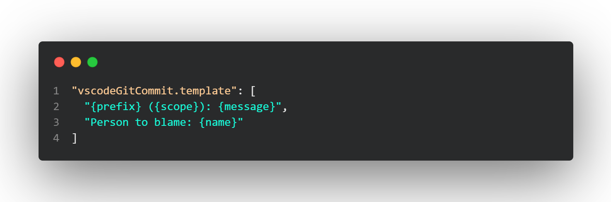
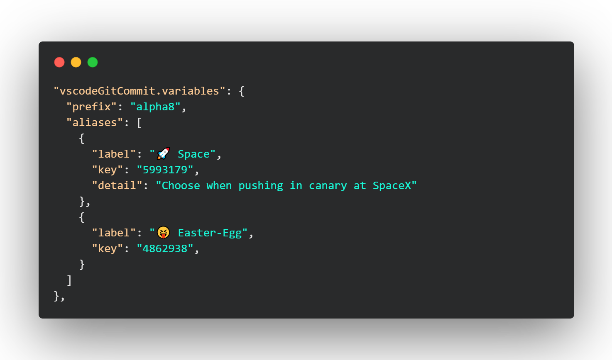
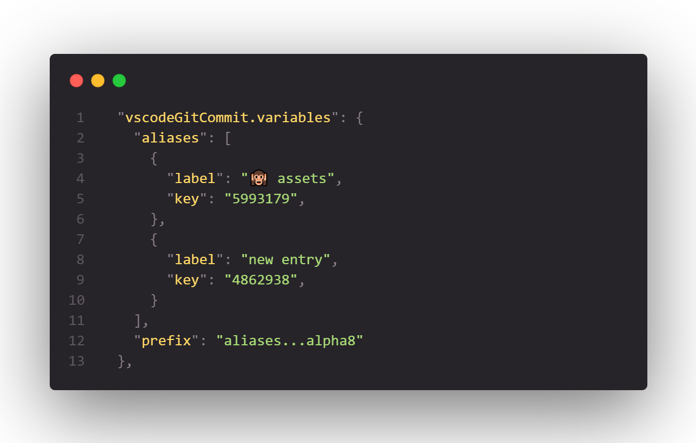

# Settings

### 1. **Erase previous commit on new one** (`vscodeGitCommit.insertMode`)

Options:

- Concatenate
- Replace

### 2. **Create my own template message** (`vscodeGitCommit.template`)

> Each entry of the array is a new line in message template

> Variables are automatically prompted

> You can create as many lines as you want and as many variables as you want.

### 3. **Use select or text for each variables** (`vscodeGitCommit.messageTemplate`)

> Each entry of the array is a variable used in template

> Variables are automatically prompted, if you give an array of elements, a select is displayed, else if you give a string, it takes one of presets saved in the extension (in the future files list for example)
> Available presets for variables are **alpha8 semantic keke angular**

> You can create as many lines as you want and as many variables as you want.

> If a variable is not defined in this setting but defined in template setting, a text input is displayed

> `!NEW!` If a variable need content of an other one, you can use the operator `...` to merge multiple variables let me explain it with an example above (prefix variable is combining firstly the **aliases** and secondly the preset **alpha8**)

